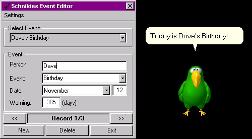



## Schnikies\!\! \- A Birthday Reminding Program\.

### Description

Schnikies is a program that I have developed over the last 4 years to help me remember all my friend's birthdays. Originally I had written it using an Access Database to store the data, but more recently I have upgraded it to use an XML data file as the back-end data store, as well as using a Microsoft Agent for presentation. After entering all the events you want to remember, Schnikies will check for upcoming birthdays every time you log into your computer. If a birthday is coming up, Peedy the Parrot will count down to the event. On the day of someone&#8217;s birthday, Peedy will sing Happy Birthday to them. This program has saved me from missing countless Birthdays, Anniversaries, etc.   

Not only is this a very usefully application, but there are a lot of things you can learn from it. The following program techniques are utilized in this application:  

1.	XML Based Data Storage 

This application uses an XML text file as for its data storage, but from the users perspective it might as well be a SQL database. The result is a very light weight application. And I have designed this application so that you could very easily swap in a class that I have written that uses Microsoft&#8217;s SAX2 technology for parsing the XML File. SAX2 will provide a highly scalable solution for large amounts of data. (If you are interested in this, review my prior postings to get the SAX2 implementation.)  

2.	Microsoft Agent Programming 

This application uses Peedy, a Microsoft Agent, for its presentation. Not only is it a cute animated character, but you can even have it talk by installing the Text-to-Speech drivers.   

3.	Randomization 

All of Peedy&#8217;s actions are chosen at Random. From his location on the screen to his expressions, you can learn how to code random behavior.  

4.	Binary Search 

On a side note, a Binary Search Algorithm is used to alphabetically sort the XML recordset while loading the XML File.  

I hope you enjoy this program. Please feel free to comment and PLEASE VOTE!!  

NOTE - Please be sure to read the Readme.txt file which comes with the project, which contains instructions for how to setup your machine.
 
### More Info
 

             |
---                |---
**Submitted On**   |2001-03-21 13:00:48
**By**             |[David Drake](https://github.com/Planet-Source-Code/PSCIndex/blob/master/ByAuthor/david-drake.md)
**Level**          |Intermediate
**User Rating**    |4.6 (37 globes from 8 users)
**Compatibility**  |VB 6\.0
**Category**       |[Complete Applications](https://github.com/Planet-Source-Code/PSCIndex/blob/master/ByCategory/complete-applications__1-27.md)
**World**          |[Visual Basic](https://github.com/Planet-Source-Code/PSCIndex/blob/master/ByWorld/visual-basic.md)
**Archive File**   |[Schnikies\!17848422001\.zip](https://github.com/Planet-Source-Code/david-drake-schnikies-a-birthday-reminding-program__1-22089/archive/master.zip)

